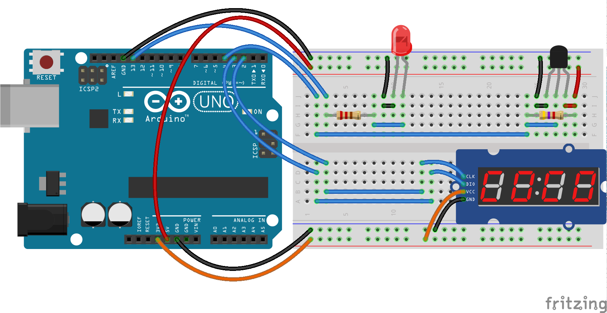

# arduino-uno-temperature-monitor


[](https://paypal.me/oliverfindl)

Source code for simple temperature monitor built with Arduino UNO board, DS18B20 temperature sensor, TM1637 display and signal LED.

---

## Parts

1x Arduino UNO Rev3  
1x DS18B20 temperature sensor  
1x TM1637 display  
1x LED  
1x 220 ohm resistor  
1x 4.7k ohm resistor  
1x Breadboard + wires  

## Schema



## Permissions

```bash
$ sudo chmod a+rw /dev/ttyACM0
```

---

## License

[MIT](http://opensource.org/licenses/MIT)
